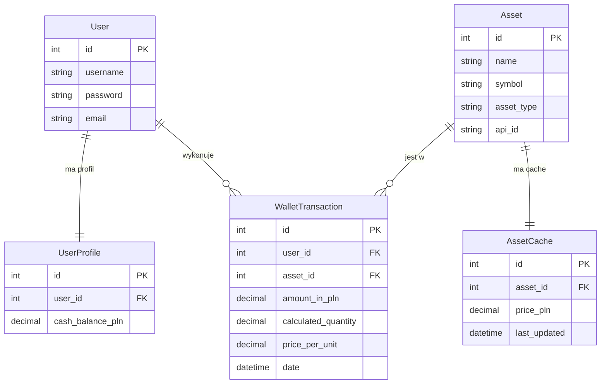

# Projekt ISI: Wallet App - Agregator Portfela Kryptowalut i Walut 💰

### Dane autora:
+ **Imię i nazwisko:** [Natalia Lewandowska]
+ **Kierunek:** [Informatyka]
+ **Grupa:** [235IC A1]

---
## Opis projektu

Wallet App to aplikacja webowa umożliwiająca monitorowanie osobistego portfela inwestycyjnego w oparciu o dane rynkowe pobierane z zewnętrznych API. Użytkownik może zasilać konto wirtualnymi środkami, kupować kryptowaluty i waluty tradycyjne po aktualnych kursach rynkowych, a następnie śledzić wartość swojego portfela w czasie rzeczywistym.

---

## 🚀 Funkcjonalności:

- Rejestracja i logowanie użytkowników
- Zasilanie konta środkami w PLN
- Kupno kryptowalut (BTC, ETH) i walut tradycyjnych (USD, CHF) po aktualnych kursach
- Wyświetlanie aktualnej wartości portfela z przeliczeniem zysku/straty
- Historia transakcji z możliwością sprzedaży po aktualnej cenie rynkowej
- Wykres kołowy struktury portfela
- Cachowanie kursów walut (10 minut) - ograniczenie zapytań do API

---

## 🛠 Stos technologiczny:

### Frontend
- HTML
- CSS

### Backend
- Django 5.0 (Python)

### Baza danych
- PostgreSQL 15 (Docker + Render) / SQLite (lokalnie)

### Zewnętrzne API
- CoinGecko (krypto)
- NBP (waluty fiat)

### Konteneryzacja
- Docker
- Docker Compose

### Testowanie
- Django TestCase

### CI/CD
- GitHub Actions

### Wdrożenie
- Render.com

---

### Schemat bazy danych:



---

### Endpointy aplikacji:

Wbudowane:

1. /login/ - GET, POST - Logowanie - Dostęp publiczny
2. /logout/ - POST - Wylogowanie - Dostęp zalogowany
3. /register/ - GET, POST - Rejestracja - Dostęp publiczny

Własne:

4. /dashboard/ - GET, POST - Panel portfela, dodawanie środków - Dostęp zalogowany
5. /invest/ - GET, POST - Zakup waluty - Dostęp zalogowany
6. /transaction/<pk>/delete/ - GET - Sprzedaż transakcji - Dostęp zalogowany

---

### Instrukcja uruchomienia Docker:

Budowanie i start:

```bash
docker-compose up --build
```

Aplikacja będzie dostępna:
```text
http://localhost:8000
```

Docker automatycznie wykona migracje bazy danych przy starcie.

---

### Link do wersji live:

https://wallet-app-30ib.onrender.com